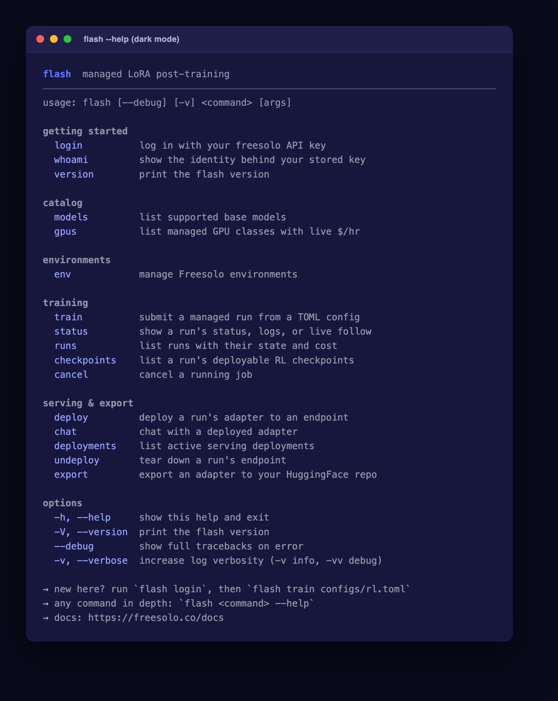
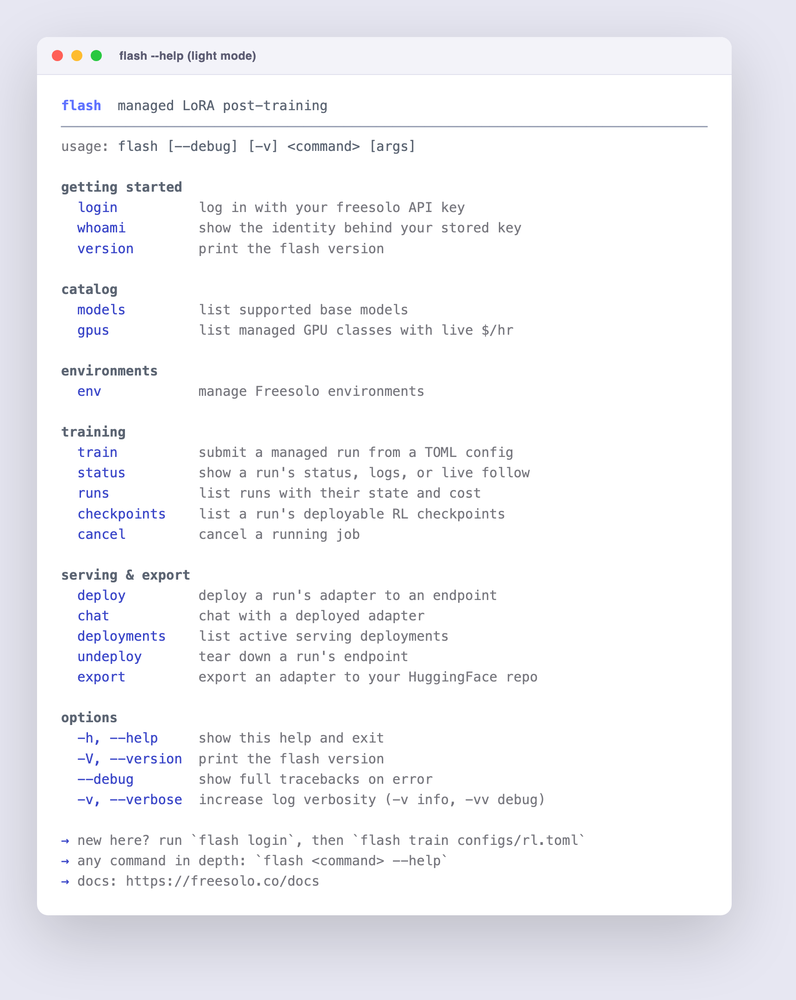
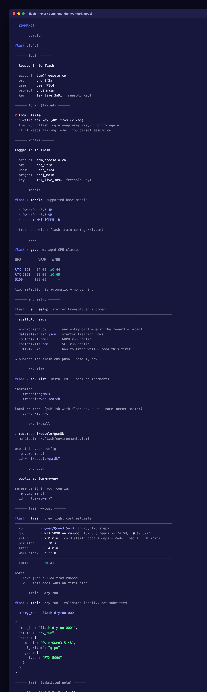
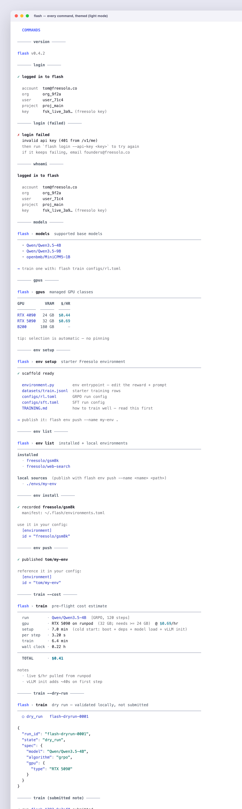
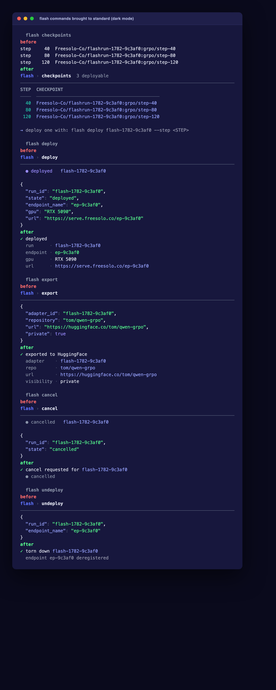
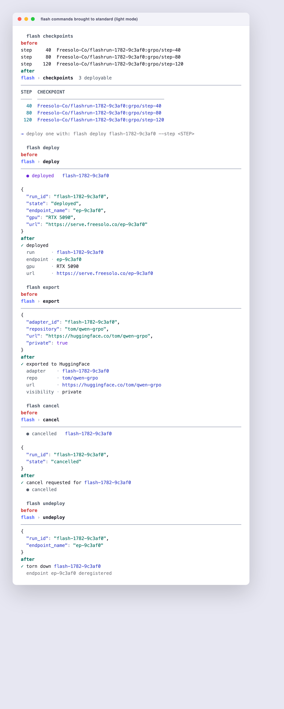

# flash CLI theme

The `flash` CLI renders a themed human view on an interactive terminal (the Freesolo brand
palette, aligned panels/tables, status badges, next-step hints) and falls back to plain,
byte-for-byte machine output when piped or scripted (`FLASH_STYLE=0`, `NO_COLOR`, a non-TTY
stdout, or an ASCII locale). It mirrors the website's light and dark themes and auto-detects
which to use from the terminal background (override with `FLASH_THEME=light|dark`).

These are faithful renders of the real truecolor output (ANSI captured from the CLI, framed in
a terminal window). Each pair is dark mode then light mode.

## `flash --help`

## Every command, themed

The full surface: account, catalog, environments, training, serving, and the message idioms
(errors, warnings, transient notes, next-step hints, log dividers).

## Before / after — commands brought up to standard

`checkpoints` was unthemed plain text; `deploy` / `export` / `cancel` / `undeploy` dumped raw
JSON under a header. They now use the house idioms (a themed table and curated `✓` cards). The
machine/JSON output is unchanged.

